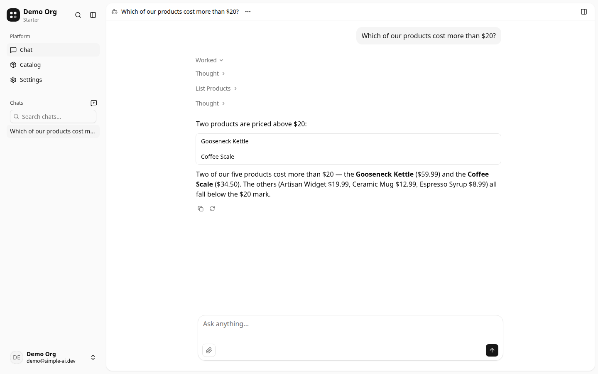

# simple-ai starter

A full-stack Cloudflare app where every organization gets its own AI agent.
The chat UI is simple-ai's [`chat-page`](https://www.simple-ai.dev) wired to a
[Cloudflare Agents SDK](https://developers.cloudflare.com/agents/) Durable
Object, and `products` is the example domain you rename into yours. Built for
developers and their coding agents building an AI-first app.



## Getting started

Use this template on GitHub, or clone it:

```bash
git clone https://github.com/Alwurts/simple-ai-starter.git
cd simple-ai-starter
pnpm install
```

You need Node 20+ and pnpm 11+ (this repo pins `packageManager:
pnpm@11.5.2`; run `corepack enable` if needed).

Copy the example env file and set a `BETTER_AUTH_SECRET` (see
[Better Auth's installation docs](https://www.better-auth.com/docs/installation)
for help generating one):

```bash
cp apps/web/.dev.vars.example apps/web/.dev.vars
```

The org agent needs one inference provider. The default is
[Vercel AI Gateway](https://vercel.com/docs/ai-gateway): set
`AI_GATEWAY_API_KEY` and it uses `google/gemini-3-flash` unless
`ORG_CHAT_MODEL` says otherwise. Alternatives: Cloudflare Workers AI,
[z.ai](https://z.ai/), or any OpenAI-compatible endpoint — see
[`docs/guides/org-agent-inference-providers.md`](docs/guides/org-agent-inference-providers.md).
Sign-in works without a provider; chat does not.

Migrate the local database and start the app:

```bash
pnpm db:migrate
pnpm dev
```

Open http://localhost:4011, sign up, and create an organization. Want sample
data instead? `pnpm db:seed` seeds a demo user, demo org, and a few example
products into the local database (local only).

## What's included

- **Auth + organizations** — [Better Auth](https://www.better-auth.com/) with
  the organization plugin: sign-up/sign-in, invitations, members, org switcher.
- **The `products` example slice** — one table walked through every layer:
  catalog UI, Hono API, and the agent's five product tools. Rename it into
  your domain.
- **The org agent** — one Durable Object per organization, chat over your
  data with saved chats, org memory, a shared org workspace, a `delegate`
  sub-agent, tool approvals, context compaction, conversation search, one
  bundled skill, an opt-in fetch tool (`FETCH_ALLOWED_HOSTS`), and sandboxed
  code execution (`execute` via the `LOADER` binding; approval-gated tools
  pause inside the sandbox).
- **An end-to-end type-safe stack** with no code generation, from the database
  to the UI.

How the agent is put together — and how to add your own tools:
[`docs/guides/writing-agent-tools.md`](docs/guides/writing-agent-tools.md).

## Stack

| Layer | Technology |
|-------|-----------|
| **Framework** | [TanStack Start](https://tanstack.com/start), full-stack React |
| **Agent** | [Cloudflare Agents SDK](https://developers.cloudflare.com/agents/) + [@cloudflare/think](https://developers.cloudflare.com/agents/concepts/think/), one Durable Object per org |
| **Chat UI** | simple-ai [`chat-page`](https://www.simple-ai.dev) |
| **API** | [Hono](https://hono.dev/) RPC, type-safe from route to client |
| **Database** | [Drizzle ORM](https://orm.drizzle.team/) + [Cloudflare D1](https://developers.cloudflare.com/d1/) |
| **Auth** | [Better Auth](https://www.better-auth.com/) with the organization plugin |
| **AI SDK** | [Vercel AI SDK](https://sdk.vercel.ai/) |
| **UI** | [shadcn/ui](https://ui.shadcn.com/) + [Base UI](https://base-ui.com/) + [Tailwind CSS v4](https://tailwindcss.com/) |
| **Email** | [Resend](https://resend.com/) + [React Email](https://react.email/) |
| **Tooling** | Turbo, pnpm, Biome, TypeScript |
| **Deployment** | Cloudflare Workers via Wrangler |

## Project layout

A pnpm + Turbo monorepo, layer-sliced and feature-keyed: `apps/web` plus
packages such as `db`, `contract`, `core`, `agent`, and `ui`. A capability is
the same key `<cap>` repeated across layers — find one slice and you know
where the rest live. The full map and a worked example:
[`docs/architecture.md`](docs/architecture.md).

## Deploy

Deploying needs Cloudflare resources first:

1. Durable Objects require a **Workers Paid** plan.
2. `wrangler d1 create simple-ai-starter`, then paste the id into
   `apps/web/wrangler.jsonc` (`database_id` is
   `placeholder-replace-before-deploy` until you do).
3. Set the Worker secrets (`wrangler secret put`): `BETTER_AUTH_SECRET`, your
   provider key (`AI_GATEWAY_API_KEY` by default), and `RESEND_API_KEY` if you
   send real email.
4. Migrate the remote database: `pnpm db:migrate:prod`.
5. `pnpm build`, then deploy (`pnpm --filter web deploy`).

The code-execution sandbox uses the `worker_loaders` binding declared in
`apps/web/wrangler.jsonc`. Deploys can also run from GitHub Actions —
`.github/workflows/deploy.yml` is manual (`workflow_dispatch`) and never runs
on push.

## Tests

- `pnpm verify` — everything CI runs: lint, typecheck, unit tests, build.
- `pnpm --filter web test:e2e` — Playwright drives a full chat turn against a
  local fake model server on its own port and state.

## Where to go next

- [`AGENTS.md`](AGENTS.md): commands and conventions once you are working in
  the repo.
- [`docs/architecture.md`](docs/architecture.md): the layer map and a worked
  feature example.
- [`docs/guides/`](docs/guides/): code-anchored how-tos.
- [`docs/decisions/`](docs/decisions/): the architecture decision records.

## License

[MIT](LICENSE).
