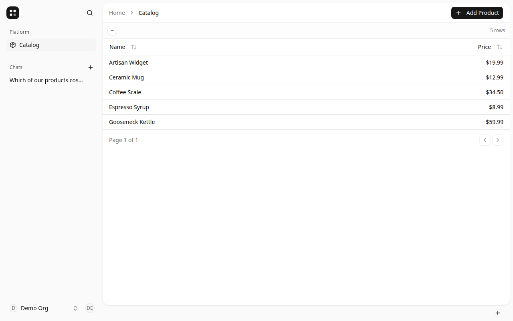
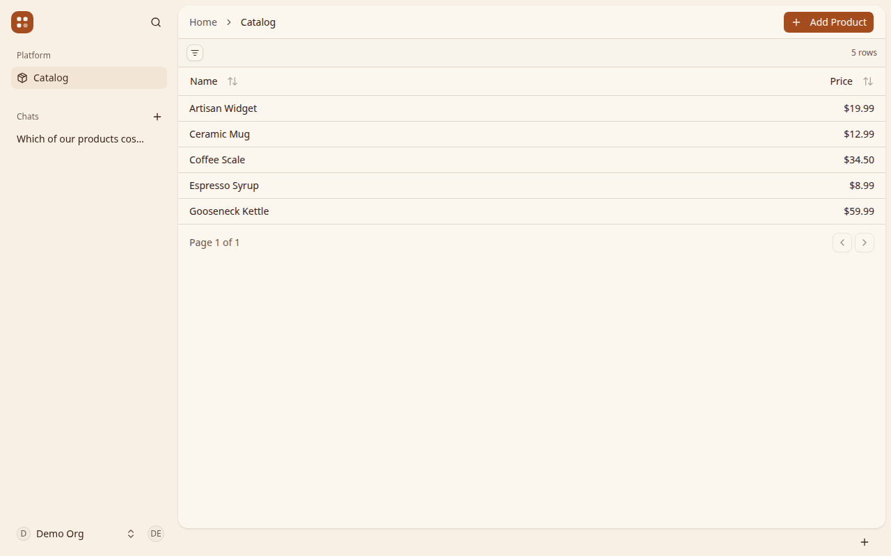
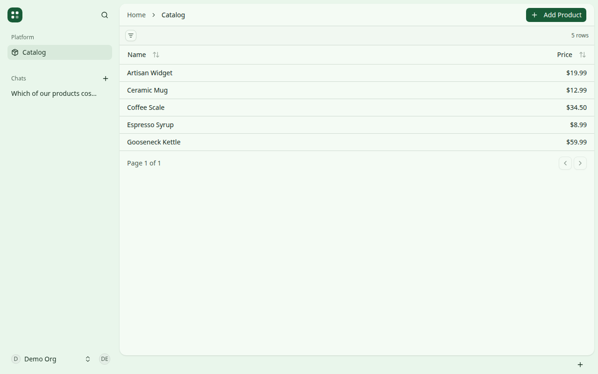

# Starting questions

Read this before you edit when someone points you at this repo and wants it
turned into their app. They may not be technical. Ask in their words, then
change the template. Setup in the [README](../README.md#getting-started) is
your work: `pnpm install`, `.dev.vars`, `pnpm db:migrate`, `pnpm dev`, then
open http://localhost:4011. Do not ask them to run those commands.

Day-to-day work after the app is already theirs stays in
[`AGENTS.md`](../AGENTS.md) and [`docs/architecture.md`](architecture.md).

## What is already here

Say this in plain language before you ask, and skip any part they already
know.

- It is a private app. People sign up, name the business, and sign in. It is
  not a public shop window, and it does not take payment.
- The list is one example slice called `products`: a name, an optional short
  description, and a price. The sample rows are things like a mug, a kettle,
  and a scale. That slice is the one you rename. There is no photo, no count
  of how many are left, and no orders.
- Signed-in people can chat with an assistant that can look at the list and,
  after they approve, change it. The assistant can also remember a short fact
  about how the business works.
- Settings cover the organization and its members.

## How to ask

Ask **one** question per turn. A short follow-up in the same turn is fine.
Skip anything they already answered. Use their words for the business, the
list, and one item. Do not ask them to pick a stack, a database, a port, or a
CSS variable.

Stop when you can start. Enough is:

- what the business is called
- who signs in on the first day, and who does not
- what they call one item
- whether a name, a short description, and a price are enough

You may defer a full life story of the business, a second example item, and
the look-and-feel question. If they already answered the four points above,
start changing the app. Do not keep interviewing for completeness.

If two answers conflict, ask which one they mean before you code. Otherwise
carry on. Do not ask permission to continue once they have asked you to make
the app.

## Questions

Ask in this order. Reorder if they lead somewhere else.

1. **What should we call this, and what do you call one thing on the list?**
   The business name, and their word for an item.
2. **Who is it for on the first day?** Who signs in? Who does not? Just them,
   them and someone who helps, or customers too?
3. **What should the first version do?** A private list, a page other people
   can look at, or something else?
4. **For one item, are a name, a short description, and a price enough?** If
   not, what else should each item remember, such as a note, how many are
   left, or a photo?
5. **What should the chat help with, and what should it remember?** Ordinary
   questions about the list, and one standing fact about how they work. Skip
   if they already said they do not want the chat.
6. **What is one real item to put on the list?** Name, price, and anything
   from question 4, so the first screen is theirs.
7. **Look and feel, last.** Only if the four stop-condition answers are in.
   Show the three pictures below and ask which is closest, or whether to
   leave it as it is. Then follow [Look and feel](#look-and-feel).

## What you change

You translate the answers. They do not.

- Put their business name on the chrome. Replace the word Catalog, and the
  word for an item, everywhere a person can see it, including the assistant's
  wording.
- Rename the `products` slice through the layers. The map is
  [the worked example](architecture.md#worked-example-a-read-and-a-write-through-products).
  Change the whole slice, not only the sidebar label.
- Replace the sample rows with the item they gave you. If they
  have not named one yet, keep a single obvious placeholder in their words
  and replace it when they do.
- Add a column only when they asked for it on each item (a note, how many are
  left, a photo). A standing fact about the business, such as where pickup
  is, stays a memory the assistant already has. Do not invent a new table for
  that.
- Keep the chat unless they said they do not want it.
- When they need to look, tell them the address and the email and password
  you created, in one plain sentence. Create that account yourself.

Your replies stay in their words. Install trouble, ports, model names, and
stream glitches stay in your work. Do not narrate them.

## Look and feel

The three pictures are the catalog in light mode. **Ink** is what ships.
Leave [`packages/ui/src/styles/globals.css`](../packages/ui/src/styles/globals.css)
alone if they pick Ink or say to leave it.







Show those three images in the chat. Ask which is closest. Do not ask for a
color code, a hex value, or an `oklch` number.

For Clay or Grove, set the variables below in **both** `:root` and `.dark`.
Leave `--destructive`, `--destructive-foreground`, `--chart-1` through
`--chart-5`, and `--radius` as they are. Primary text has to stay readable on
the primary color: the pairs below already do.

### Clay

`:root`

```css
--background: oklch(0.975 0.012 80);
--foreground: oklch(0.28 0.04 50);
--card: oklch(0.99 0.008 80);
--card-foreground: oklch(0.28 0.04 50);
--popover: oklch(0.99 0.008 80);
--popover-foreground: oklch(0.28 0.04 50);
--primary: oklch(0.52 0.13 45);
--primary-foreground: oklch(0.98 0.01 80);
--secondary: oklch(0.94 0.02 75);
--secondary-foreground: oklch(0.32 0.04 50);
--muted: oklch(0.94 0.015 75);
--muted-foreground: oklch(0.48 0.03 55);
--accent: oklch(0.93 0.03 70);
--accent-foreground: oklch(0.32 0.04 50);
--border: oklch(0.88 0.02 70);
--input: oklch(0.88 0.02 70);
--ring: oklch(0.62 0.1 45);
--sidebar: oklch(0.96 0.018 75);
--sidebar-foreground: oklch(0.28 0.04 50);
--sidebar-primary: oklch(0.52 0.13 45);
--sidebar-primary-foreground: oklch(0.98 0.01 80);
--sidebar-accent: oklch(0.93 0.025 70);
--sidebar-accent-foreground: oklch(0.32 0.04 50);
--sidebar-border: oklch(0.88 0.02 70);
--sidebar-ring: oklch(0.62 0.1 45);
```

`.dark`

```css
--background: oklch(0.22 0.02 50);
--foreground: oklch(0.96 0.01 80);
--card: oklch(0.24 0.02 50);
--card-foreground: oklch(0.96 0.01 80);
--popover: oklch(0.24 0.02 50);
--popover-foreground: oklch(0.96 0.01 80);
--primary: oklch(0.75 0.1 55);
--primary-foreground: oklch(0.25 0.04 50);
--secondary: oklch(0.32 0.02 50);
--secondary-foreground: oklch(0.96 0.01 80);
--muted: oklch(0.32 0.02 50);
--muted-foreground: oklch(0.75 0.02 70);
--accent: oklch(0.34 0.03 50);
--accent-foreground: oklch(0.96 0.01 80);
--border: oklch(0.36 0.02 50);
--input: oklch(1 0 0 / 15%);
--ring: oklch(0.7 0.08 55);
--sidebar: oklch(0.26 0.025 50);
--sidebar-foreground: oklch(0.96 0.01 80);
--sidebar-primary: oklch(0.75 0.1 55);
--sidebar-primary-foreground: oklch(0.25 0.04 50);
--sidebar-accent: oklch(0.34 0.03 50);
--sidebar-accent-foreground: oklch(0.96 0.01 80);
--sidebar-border: oklch(0.36 0.02 50);
--sidebar-ring: oklch(0.7 0.08 55);
```

### Grove

`:root`

```css
--background: oklch(0.98 0.012 145);
--foreground: oklch(0.27 0.04 155);
--card: oklch(0.995 0.006 145);
--card-foreground: oklch(0.27 0.04 155);
--popover: oklch(0.995 0.006 145);
--popover-foreground: oklch(0.27 0.04 155);
--primary: oklch(0.42 0.09 155);
--primary-foreground: oklch(0.98 0.01 145);
--secondary: oklch(0.94 0.02 150);
--secondary-foreground: oklch(0.3 0.04 155);
--muted: oklch(0.94 0.015 150);
--muted-foreground: oklch(0.46 0.03 155);
--accent: oklch(0.92 0.03 150);
--accent-foreground: oklch(0.3 0.04 155);
--border: oklch(0.88 0.02 150);
--input: oklch(0.88 0.02 150);
--ring: oklch(0.55 0.08 155);
--sidebar: oklch(0.96 0.02 150);
--sidebar-foreground: oklch(0.27 0.04 155);
--sidebar-primary: oklch(0.42 0.09 155);
--sidebar-primary-foreground: oklch(0.98 0.01 145);
--sidebar-accent: oklch(0.92 0.025 150);
--sidebar-accent-foreground: oklch(0.3 0.04 155);
--sidebar-border: oklch(0.88 0.02 150);
--sidebar-ring: oklch(0.55 0.08 155);
```

`.dark`

```css
--background: oklch(0.2 0.02 155);
--foreground: oklch(0.96 0.01 145);
--card: oklch(0.23 0.02 155);
--card-foreground: oklch(0.96 0.01 145);
--popover: oklch(0.23 0.02 155);
--popover-foreground: oklch(0.96 0.01 145);
--primary: oklch(0.78 0.1 155);
--primary-foreground: oklch(0.22 0.04 155);
--secondary: oklch(0.3 0.02 155);
--secondary-foreground: oklch(0.96 0.01 145);
--muted: oklch(0.3 0.02 155);
--muted-foreground: oklch(0.75 0.02 150);
--accent: oklch(0.32 0.03 155);
--accent-foreground: oklch(0.96 0.01 145);
--border: oklch(0.34 0.02 155);
--input: oklch(1 0 0 / 15%);
--ring: oklch(0.7 0.08 155);
--sidebar: oklch(0.24 0.025 155);
--sidebar-foreground: oklch(0.96 0.01 145);
--sidebar-primary: oklch(0.78 0.1 155);
--sidebar-primary-foreground: oklch(0.22 0.04 155);
--sidebar-accent: oklch(0.32 0.03 155);
--sidebar-accent-foreground: oklch(0.96 0.01 145);
--sidebar-border: oklch(0.34 0.02 155);
--sidebar-ring: oklch(0.7 0.08 155);
```
